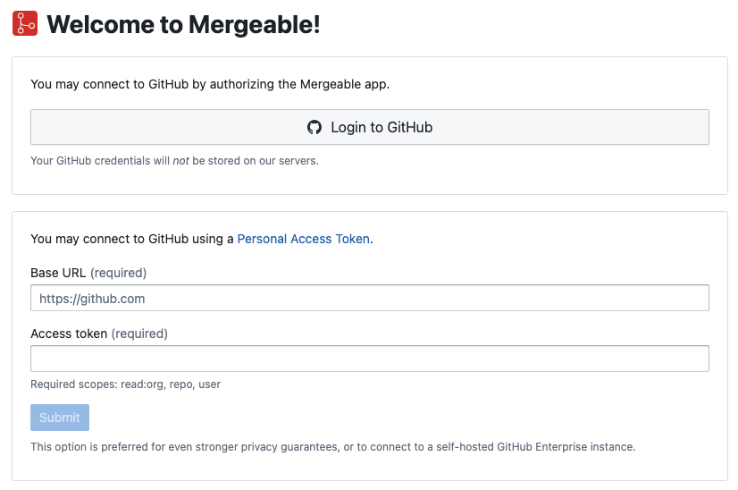
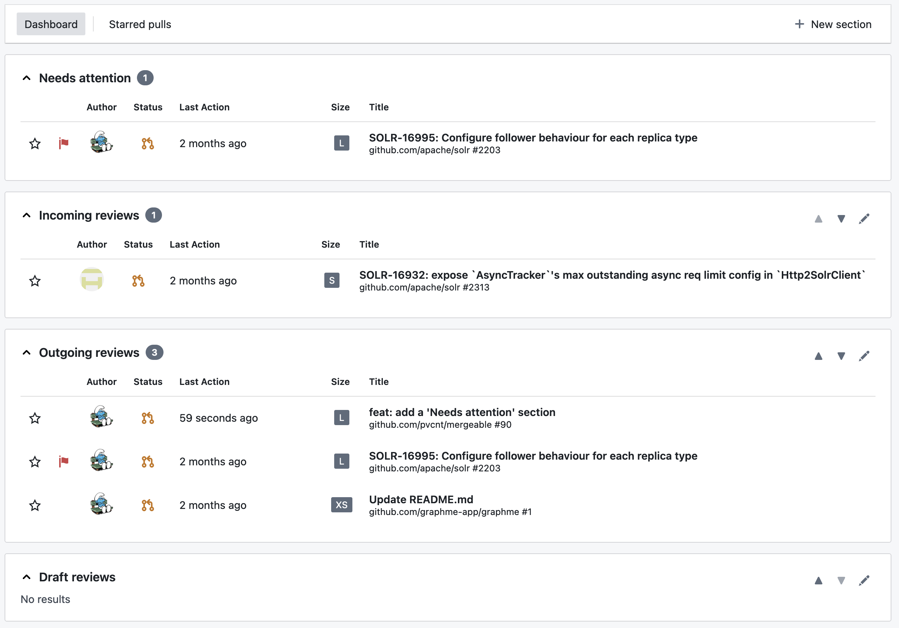

The fastest way to get started is to use the public instance of Mergeable available at [usemergeable.dev](https://app.usemergeable.dev).
This instance is provided free of charge, and allows to interact with pull requests from GitHub, public and private repositories alike.

When you first start Mergeable, the login screen will appear:

If you want to use Mergeable with the public GitHub (github.com), the simplest way to get started is to click on the "Login to GitHub" button.
This will initiate an OAuth login flow, and will result in [a connection](../../user-guide/connections/) being configured.

Alternatively, you may manually provide a GitHub URL and an access token.
This is especially useful if you are connecting to a self-hosted GitHub Enterprise instance, or if you want to ensure that no credentials are transiting via Mergeable backend.

:::note
If you have very strict privacy or compliance requirements, please consider [self-hosting](../../self-host/).
:::

After being redirected to the inbox, you may already see some reviews in the dashboard if you are an active GitHub user:

