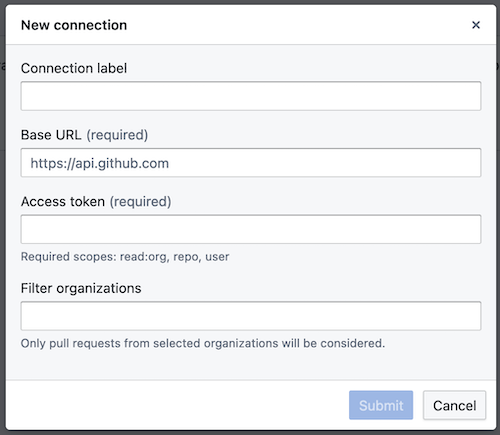

A unique capability of Mergeable is that it can connect to any number of GitHub instances.
A connection is made of a GitHub API endpoint and an access token.

Most people will use it with [github.com](https://github.com), but it is also able to connect to a GitHub Enterprise installation.
Multiple connections to the same instance may even exist, which may be useful to connect different user accounts with different permissions.

## Add a new connection

You can add a new connection from the settings page, and clicking on "New connection".
The following dialog will open:

You need to provide a URL and an access token.
The URL must be a GitHub API endpoint (**not** a UI endpoint).
For github.com, the URL is `https://api.github.com`.
For GitHub Enterprise installations, the URL is usually the hostname followed by `/api/v3`.

Because all interactions with GitHub will happen in your browser, you need to make sure that your machine has connectivity to the provided endpoint.
However, the location where Mergeable is deployed does not matter, since it will not directly reach out to GitHub.

The access token is generated from GitHub from Settings > Developer settings > Personal access tokens.
Please refer to GitHub's documentation to [learn more about access tokens](https://docs.github.com/en/authentication/keeping-your-account-and-data-secure/managing-your-personal-access-tokens).

The label is optional and purely informational.
It is only used in the settings page to help distinguish similar connections (e.g., two connections to the same instance of GitHub).

The organizations filter is used to restrict access to a connection to a particular set of GitHub organizations.
By default, Mergeable will search across all pull requests that the access token has access to.
In some situations, you may want to only search across a subset of GitHub organizations, e.g., to restrict the scope to a business or personal context.

## Edit a connection

You may edit an existing connection by clicking on the "Edit" button in its row.
The edit dialog also contains a link to delete the connection permanently.

## Access token permissions

GitHub personal access tokens come in two flavours: classic and fine-grained.
For now, Mergeable has only been tested with classic access tokens.
To be used with Mergeable, an access token needs at least the following scopes:

- `read:org`: Access which teams a user is a member of, used to determine if it is a requested reviewer via a requested team.
- `repo`: Search for pull requests and related information, such as reviews and CI checks.
- `user`: Access basic information about the user, such as their name.
