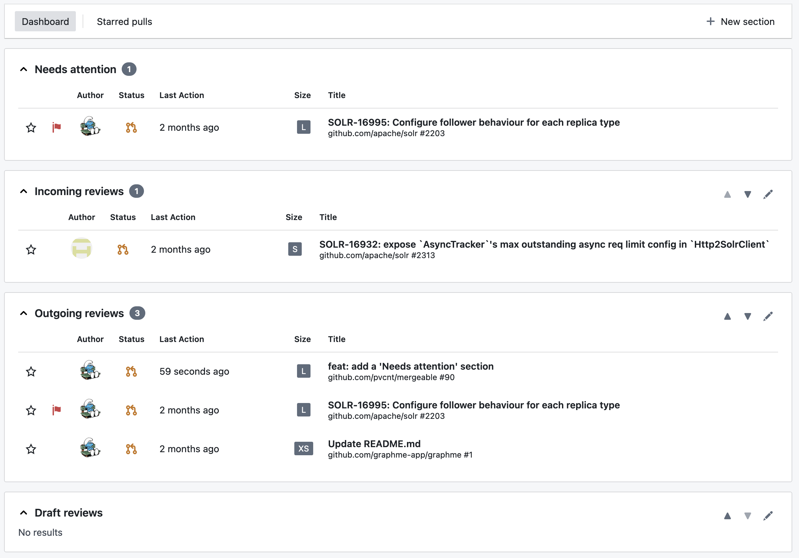

The fastest way to get started is to use the public instance of Mergeable available at [mergeable.pages.dev](https://mergeable.pages.dev).
This instance is provided free of charge, and allows to interact with pull requests from [github.com](https://github.com), from public and private repositories alike.

:::note
If you need to interact with a private GitHub Enterprise instance, please consider [self-hosting](../../self-host/).
:::

When you first start Mergeable, it displays an empty dashboard, because it is not connected to any GitHub instance.
From [the Settings page](https://mergeable.pages.dev/settings), accessible via the sidebar, click on the "New connection" button.
The following dialog will open:

You only have to provide an access token, that you can [obtain from GitHub](https://github.com/settings/tokens).
Copy and paste the access token in the dialog, and click on "Submit".
After going back to [the Inbox page](https://mergeable.pages.dev/inbox), you may already see some reviews in the dashboard if you are an active GitHub user:

