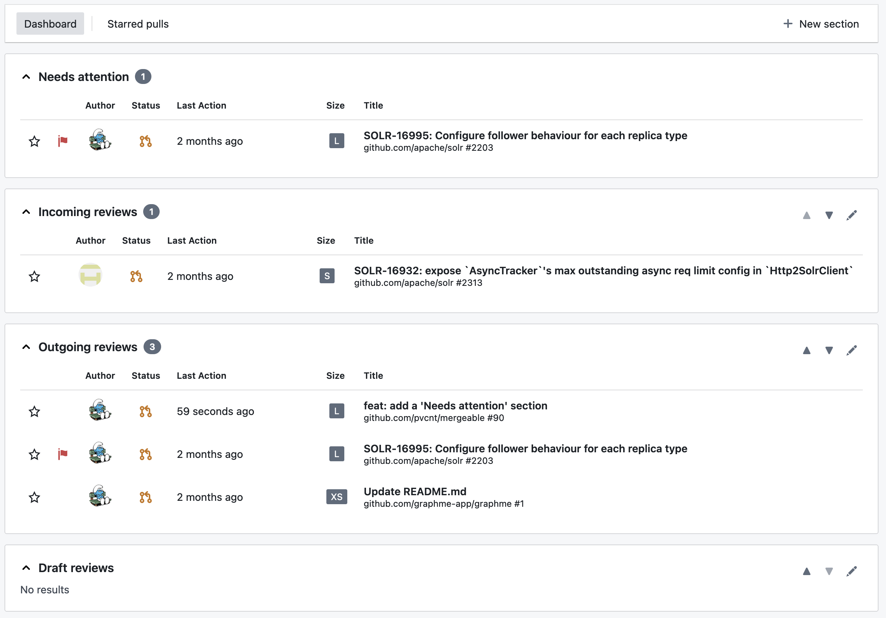

We found that the "[Pull Requests](https://github.com/pulls)" page provided by GitHub is not enough in most situations to efficiently track pull requests.
It comes with four tabs associated with pre-defined search queries, that cannot be changed.
Switching between tabs is slow, and there is no way to see all pull requests from those tabs at once.

Mergeable is a better inbox for GitHub pull requests, that displays all pull requests of interest on a single page in a very flexible manner:

## Compare with...

There are many tools that attempt to improve GitHub's experience with pull request.
Mergeable distinguishes itself with the following features:

* **Open source:** Most tools are commercial or closed source.
Mergeable is free and open source, under the permissive MIT license.
* **Self-hostable:** Most tools are provided as a hosted service.
We encourage our users to self-host Mergeable, allowing them to personalize their instance as they wish.
Mergeable can be very easily hosted on any Web server or hosting platform supporting static files.
* **Multiple connections:** Most tools are connected to a single GitHub instance, either github.com or a private GitHub Enterprise instance.
Mergeable allow to configure multiple connections, and to track pull requests across any number of instances and accounts.
* **No GitHub app:** Some tools require a GitHub app to be installed in target organizations.
GitHub apps provide many advantages, but it also means that users rely on organization admins to install this app.
Mergeable is non intrusive and does not require any GitHub app to be installed.
It acts on behalf on the user, using their access token.