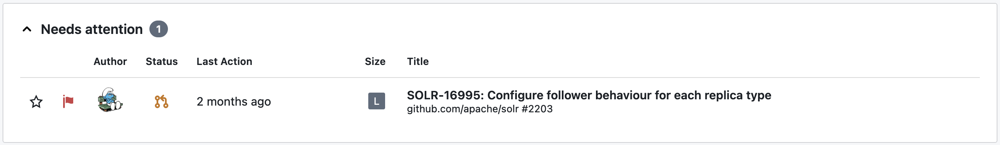
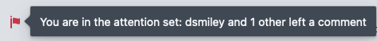

The attention set tracks pull requests that require your attention.
This feature is designed after similar features in [Gerrit](https://gerrit-review.googlesource.com/Documentation/user-attention-set.html), [Critique](https://abseil.io/resources/swe-book/html/ch19.html#quotation_marksemicolonwhose_turnquotat) and [Aviator](https://docs.aviator.co/attentionset).

## Whose turn?

Code review is a turn-based process: at any time, somebody is expected to take action.
For example, when the author first opens a pull request and assigns reviewers, the latter are in the attention set because they are expected to leave a review.
Later, when the reviewer leave some comments, the author is in the attention set because they are expected to reply to those comments.

Tracking whose turn it is to take action is instrumental in helping pull requests move towards being merged. 
The general expectation is that when a reviewer or author is in the attention set, they should respond in a timely manner.

## View the attention set

The attention set is prominently visible in several parts of the inbox.

### Inbox section

The first section in the inbox is the "Needs attention" section:

It displays all pull requests that are in the attention set.
It cannot be moved or modified.
It can be hidden by disabling the "Pull requests in this section can be in the attention set" option for all sections.

### Attention flag

In all sections, pull requests that are in the attention set are highlighted with a red flag.
Hovering over this flag displays the reason why the pull request is in the attention set:

### Tab title

The title of a Mergeable tab includes the number of pull requests in the attention set.
For example, if there are three such pull requests, the title of the tab would be "(3) Mergeable".

## Attention set rules

Whether a user is in the attention set of a pull request is determined by a set of rules:

* A draft, merged or closed pull request has an empty attention set.
* A requested reviewer (either directly or via a team) is in the attention set if the pull request is not already approved.
Once they leave a review, they will not be "requested" anymore.
* An author is in the attention set when a pull request is approved.
* An author or reviewer is in the attention set when somebody replied to them.
* An author is in the attention set when a reviewer left a comment in any thread.

:::note
Those rules are designed to be "mostly correct", but they are not expected to be perfect and work for all use cases.
If you notice a situation where the algorithm is incorrect and could be improved, you are welcome to [file an issue](https://github.com/pvcnt/mergeable/issues/new).
:::