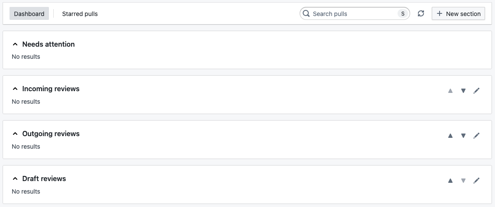
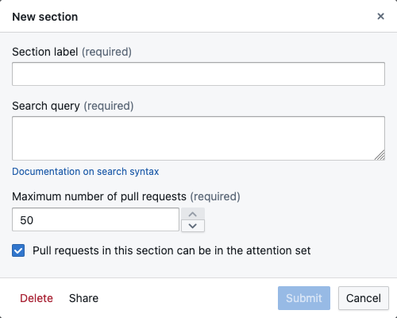

The landing page of Mergeable is its inbox, that shows all pull requests in your radar.

## Dashboard sections

The dashboard displays a list of sections, each of them being defined as a search query against pull requests.
By default, some default sections are populated:

But those are only created for your convenience, as they can all be modified or even replaced.
Please note that nothing prevents a pull request from appearing in several sections.

### Add a new section

You can add a new section at the bottom by clicking on the "New section" button in the header.
The following dialog will open:

The search query uses [GitHub's search language](https://docs.github.com/en/search-github/searching-on-github/searching-issues-and-pull-requests), with the following modifications:

- A `type:pr` term is implicitely added, you do not need to include it.
- Archived pull requests are excluded by default (i.e., `archived:false`), unless the search query is explicitely searching for archived pull requests.
- Only pull requests from organizations configured in the connection are returned.
- You may provide several individual search queries separated by a semi-colon (";").
  Results from all individual search queries will be merged and displayed together in the section.

### Edit a section

You may edit an existing section by clicking on the pencil icon on the right side, next to its label.
The edit dialog also contains a link to delete the section permanently.

### Move sections

You may move an existing section by clicking on the up or down arrows on the right side, next to its label.
One of the arrows may be greyed, indicating that the section is already at the top or bottom of the dashboard.

### Share a section

You may share the configuration of a section by clicking on the pencil icon, and then at the bottom on the dialog on "Share".
This will copy a URL in your clipboard, that you can then share with your teammates.
Openining it in the browser will direct them to their own dashboard, with a new section dialog open and pre-populated with parameters associated with the section you shared.

## Search for pull requests

You may search for pull requests using the command bar, that is invoked by <code>cmd+k</code>:

This performs a fuzzy search on the title, and highlights the matching characters.
Clicking on a pull requests (or using keyboard arrows and hitting enter) will open the selected pull request in a new tab.

You may search for any pull request that is synchronized in Mergeable, i.e., any pull request that appears on the dashboard.
This does not allow to search for random pull requests on GitHub.

## Star pull requests

When you have too many pull requests on your dashboard, it may become difficult to identify those that require a particular attention.
Starring a pull request allows to bookmark it and make it stand apart from other pull requests.

You may (un)star a pull request by clicking on the star icon in the dashboard.
Once a pull request is starred, the star will appeared filled in the dashboard.
Starred pull requests appear in the "Starred pulls" tab of the inbox.

## Synchronize pull requests

Pull requests are automatically synchronized in the background every 5 minutes.
You may forcefully synchronize them by clicking on the refresh button in the sidebar.
Hovering over it displays the time at which pull requests were last synchronized:

:::note
Every synchronization has a cost in terms of API usage.
Indeed, GitHub API has limits in terms of how many requests may be performed per hour ([REST limits](https://docs.github.com/en/rest/using-the-rest-api/rate-limits-for-the-rest-api), [GraphQL limits](https://docs.github.com/en/graphql/overview/rate-limits-and-node-limits-for-the-graphql-api)).
Please remember that other tools using a personal access token (or OAuth login) associated with a same account will also consume the same quota.
:::
